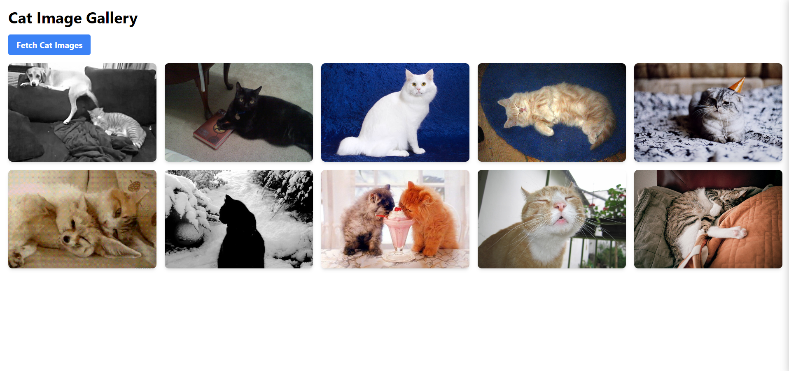
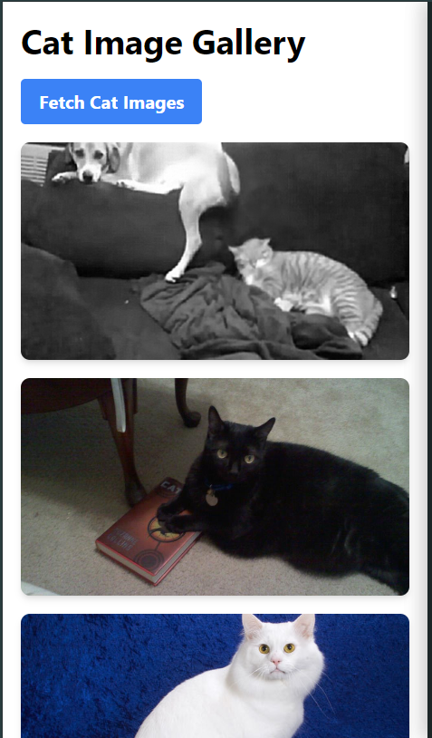

# Cat Image Viewer

A simple web application that renders cat images using an API.

## About the Project

This project is a fun and easy-to-use web application that displays random cat images fetched from a cat image API. It's perfect for cat lovers and developers looking for a simple example of how to integrate an API into a web page.

## Features

- Displays random cat images
- Simple and intuitive user interface
- Easy to set up and customize

## Project Setup

1. Clone the repository:
   ```
   git clone https://github.com/Akayush-17/Image-i-nation.git
   ```

2. Navigate to the project directory:
   ```
   cd image-view
   ```

3. Run 
   ```
   npm i
   ```

3. Run 
   ```
   npm start
   ```

## How It Works

The application uses JavaScript to fetch cat images from the [Cat API](https://api.thecatapi.com/v1/images/search?limit=5&amp;page=10&amp;order=Desc) and display them on the page. Users can click a button to load new cat images.

## Screenshots

## Easy Implementation






